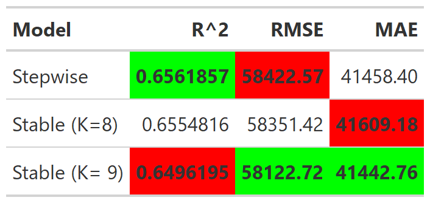
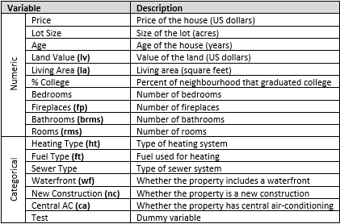

## Introduction & Dataset Description
\
\noindent When buying, developing or investing in properties, it can be difficult to decide what factors are important in maximising affordability or returns. Furthermore, house appraisals can be time consuming, expensive and prone to human error. Thus, our analysis aims to determine a systematic relationship between variables found in a housing dataset and their price using a multiple linear regression model.\
\
\noindent The dataset used was collected by Candice Corvetti, and is a random sample of 1734 houses in Saratoga County, New York in 2006. It contains 16 explanatory variables that relate to the size, age, room types, land value and categorical features of a house. These variables and their abbreviated names are described in A1.\


```{r, include = FALSE, echo = FALSE}
#install.packages("pinp")
#library(rmarkdown)
#draft("mypaper.Rmd", template="pdf", package="pinp", edit=FALSE)
#render("mypaper.Rmd")
#tinytex::install_tinytex()
library('dplyr')
library('tinytex')
library('tidyverse')
library('plotly')
library('mplot')
library('janitor')
library('gt')
library("equatiomatic")
library("webshot")
```

```{r, include =FALSE}
load("Rdata_Files/houses_main.RData")
load("Rdata_Files/model_comparison.RData")
```


```{r, echo = FALSE, include = FALSE}
df = read_tsv("Rdata_Files/housing-prices-ge19.txt") %>% clean_names()
df = df %>% mutate(central_air = if_else(central_air== 0, "no", "yes"), waterfront = if_else(waterfront== 0, "no", "yes"),test = if_else(test== 0, "no", "yes"), new_construct = if_else(new_construct== 0, "no", "yes"))
df_original = df
df_numeric = df %>% select_if(is.numeric)
df_character =  df %>% select_at(vars(names(.)[map_lgl(., is.character)], price))
```


```{r, echo = FALSE}
df = df %>% mutate(fuel_type = case_when(fuel_type=="None" ~ "no", TRUE ~ "yes"),heat_type = case_when(heat_type=="None" ~ "no", TRUE ~ "yes"),waterfront = case_when(waterfront=="no" ~ "no", TRUE ~ "yes") )%>%  mutate(log_age = log(age+1))


```

```{r, echo=FALSE, warning=FALSE, message=FALSE }
# There are some warnings for scales part but I'm not sure what they mean
require(scales)
```

\vspace{-5pt}
## Initial Filtering and Variable Transformations 
\
House prices by category was observed. From A2, not having heating or fuel type is associated with lower prices relative to other categories for their respective variables. To aid with model interpretability, they were collapsed into binary variables that do or do not have heating/fueling. From A3,the prices across categories in the test and sewer type variables didn't seem to differ drastically. Thus, these variables are not fitted in the following models.	The other categorical variables are visualised in A4.\
\
\noindent Relative to the age, $log(age+1)$ had a more pairwise linear relationship with price and thus was transformed. From A5, lot size, bedrooms and percentage college were dropped as they did not seem to be linear with price even after using a log transformation. \
\
\noindent All the assumptions of linear regression were satisfied on the full model. These will be verified again after the final model is selected.

## Model Selection
### Stepwise Regression
\
Backward and forward stepwise regression was performed. This involves a non-exhaustive construction of a regression model that iteratively drops (backward selection ) or adds (foward selection) parameters to minimise the AIC score. Both methods of stepwise regression dropped fuel type and fireplace from the final model.


```{r, echo=FALSE,include = FALSE}
df_filtered = df%>% mutate(log_age = log(age+1)) %>%   select(living_area, bathrooms,rooms, land_value, log_age, fireplaces, heat_type, fuel_type, waterfront, price, new_construct, central_air)
M0 = lm(price ~ 1, df_filtered)
M1 = lm(price ~., df_filtered) 
step.fwd.aic = step(M0, scope = list(lower = M0, upper = M1), direction = "forward", trace = FALSE)
step.back.aic = step(M1, 
                     direction = "backward", 
                     trace = FALSE)

sjPlot::tab_model(
   step.fwd.aic, step.back.aic, 
   show.ci = FALSE, 
   show.aic = TRUE,
   dv.labels = c("Forward model",
                 "Backward model") #,
   #file = "step_model.html"
)


# x = webshot("step_model.html", "step_model.png", zoom = 0.6)
```


### Model Stability
\
The variable inclusion plot varies the value of the penalty coefficient, $\lambda$, on the x-axis. On the y-axis, the probability a parameter is included in models that minimise the loss plus penalty in 150 weighted bootstrap samples is observed. This is done to see the effect of slight deviations in our samples in the selection of various parameters. If stable, the probability a parameter is selected should be relatively consistent as $\lambda$ is varied. 

\vspace{-10pt}
```{r, echo=FALSE, include = FALSE}
p1 = plot(vis.d, which="vip", interactive = FALSE)+ theme(axis.title.x = element_text( size = 7),axis.title.y = element_text(size = 7),
axis.text.x = element_text(size = 7),
axis.text.y = element_text(size = 7),                                       legend.text=element_text(size=7))
```

```{r, echo = FALSE, fig.width=3.8, fig.height=2.4}
p1+  guides(fill=guide_legend(title = "Variables"))
```
\vspace{-10pt}

\centerline{\small Figure 1:  Variable Inclusion Plot}
\smallskip
\noindent In Figure 1, `RV` is a redundant variable independent of price. Lines following a similar path to `RV` such as `ft`,`ht` and `fp` aren’t likely to be in a stable model. Conversely, `la`, `lv`, `wf`, `nc`, `brms`, `ca` and `log_age` are selected with relatively high probability throughout. The probability that the `rms's` variable is selected converges to 0 as $\lambda$ increases. However, this occurs relatively slowly. This is investigated using model stability plots (MSPs).\
\
\noindent In MSPs, $\lambda = 2$ is fixed, a circle represents a model and its size is proportional to its stability in the bootstrap samples. 
```{r, echo=FALSE, include = FALSE}
p2 = plot(vis.d, which="boot",highligh = "rms", interactive = FALSE, max.circle = 6)+ theme(axis.title.x = element_text( size = 7),axis.title.y = element_text(size = 7),axis.text.x = element_text(size = 7),axis.text.y = element_text(size = 7))
```
\vspace{-15pt}
```{r, echo = FALSE, fig.width=4.2, fig.height=2.0}
p2+ theme(legend.text=element_text(size=7)) + guides(color = FALSE, size = FALSE, fill=guide_legend(
                 keywidth=0.1,
                 keyheight=0.1,
                 default.unit="inch"))
```

\vspace{-10pt}

\centerline{\small Figure 2: Model Stability Plot}
\smallskip
\noindent From Figure 2, the model selected through stepwise regression isn’t overwhelmingly dominant in its dimension, $k=10$. Contrastingly, rooms is selected in a clear dominant model of $k=9$.  There are also stable models of $k=\text{5,7,8}$ with comparable probabilities of selection. However, this is empirically stronger for the model of size 8 as it is in a higher dimension.\
\
\noindent We proceed with the stable dominant models of $k \in \text{{8,9}}$ for model evaluation.


## Model Evaluation - K-fold Cross Validation
```{r,echo = FALSE, include = FALSE}
gt::gtsave(tb2, file = file.path("Rdata_Files/model_comparison_table.png"))
# webshot("tb2.png", "tb2.png", zoom = 0.4)
```


```{r, echo = FALSE, fig.width=3, fig.height=2, out.width = "210px", out.height = "90px"}
knitr:: 
```
\vspace{-7pt}
\centerline{\small Figure 3: 10-fold CV-Out of Sample Performance}\
\noindent  Figure 3 shows that on average, the dimension 9 stable model had the best out of sample performance in 2/3 metrics. Although it had the lowest $R^2$ value, relative to the stepwise and dimension 8 model, it performs better regardless of whether large errors are penalised to a greater extent. This is indicated by its MAE and RMSE score. Compared to $R^2$, RMSE and MAE are easier to interpret for non-statisticians. Thus, we chose to proceed with the dimension 9 model as it performs the best for these metrics.


```{r, echo = FALSE}
load("Rdata_Files/kfold_plot.RData")
```


```{r, echo = FALSE, fig.width=3, fig.height=2, fig.align = 'center'}
df_kfold  %>% ggplot(aes(x = test, y = pred)) + geom_point(size = 0.00001) + geom_abline(slope = 1, intercept = 0, colour = "orange") + labs(x = "Actual", y = "Predicted")+  theme_light()+theme(panel.border = element_rect(fill=NA, colour = "black", size=0.5), axis.title.x = element_text( size = 5),axis.title.y = element_text(size = 5),
axis.text.x = element_text(size = 5),
axis.text.y = element_text(size = 5))  + scale_y_continuous(labels = comma) +  scale_x_continuous(labels = comma)
```
\vspace{-10pt}
\centerline{\small Figure 4: Out of sample Actual vs Predicted Plot}\
\noindent Figure 4 displays the out of sample performance of the stable dimension 9 model on 20% of the data. The position of the three houses on the far right indicate that they may be overpriced, relative to the other houses. Further exploration of these observations may reveal other factors that influence house prices.

## Assumptions of the Final Selected Model
\
Assumptions of linear regression must be satisfied to ensure it is appropriate to fit a linear model and inferences are valid. They are linearity between predictors and price, homoscedasticity, independence and normality in the error distribution.\
\
\noindent From A6, there is pairwise linearity between predictors against price. In A7, the residuals are symmetrically distributed about 0, indicating multivariate linearity is satisfied.\
\
\noindent The residuals in A7 with a value above 250,000 may indicate heteroskedasticity. These points are a small proportion of the dataset and are unlikely to have a detrimental impact on inferences. Thus, we proceed with this assumption being satisfied.\


```{r, echo = FALSE, message = FALSE, Warning = FALSE, fig.width=3, fig.height=2}
df_final = df %>% select(living_area, bathrooms, log_age, land_value, waterfront, new_construct, central_air, rooms, price)
g = data.frame(res = lm(price~.,df_filtered)$residuals, fitted = lm(price~.,df_filtered)$fitted.values) %>% ggplot(aes(x=fitted, y = res))+geom_point()+geom_hline(yintercept = 0) +  geom_smooth(color='blue')+ 
  labs(x = "Fitted Values", y = "Residuals") +theme_bw()+ 
  theme(panel.spacing = unit(1, "lines"), axis.title.x = element_text( size = 25), axis.title.y = element_text(size = 25),
axis.text.x = element_text(size = 20),
axis.text.y = element_text(size = 20)) + 
scale_y_continuous(labels = comma) + 
  scale_x_continuous(labels = comma) + 
  theme(axis.text.x = element_text(angle = 30, hjust = 1))

g_l= g 
```

\noindent In A7, the residuals don’t fall on the lower and upper tail of the qqnorm diagonal line, indicating non-normality. However, since the sample size is large $(n = 1734)$, we rely on the Central Limit Theorem for approximately valid inferences.\
\
\noindent Independence is assumed by the method of data collection. 


```{r, echo = FALSE, message = FALSE, Warning = FALSE, fig.width=3.3, fig.height=2}
q = lm(price~.,df_final)$residuals %>% as.data.frame() %>% ggplot(aes(sample = .)) + stat_qq()+ stat_qq_line() + labs(x = "Theoretical Quantile", y = "Residuals")+theme_bw()+ theme(panel.spacing = unit(1, "lines"), axis.title.x = element_text( size = 25),axis.title.y = element_text(size = 25),
axis.text.x = element_text(size = 20),
axis.text.y = element_text(size = 20))+ scale_y_continuous(labels = comma)
```


```{r, echo = FALSE, fig.width=3.5, fig.height=2, message = FALSE, out.width = "250px", include = FALSE}
#ggpubr::ggarrange(g,q)
x = subplot(ggplotly(g), ggplotly(q), shareY = TRUE, titleX = TRUE, titleY = TRUE)
x = htmlwidgets::saveWidget(x, file = "Rdata_Files/assumptions_plot.html")
x = webshot("Rdata_Files/assumptions_plot.html", "Rdata_Files/assumptions_plot.png", zoom = 1)
```


```{r,echo = FALSE,out.width = "200px", out.height = "105px"}
#knitr::include_graphics("x.png")
```


## Interpreting Coefficients
\
\small
$$\operatorname{price} = 33317.24 + 67.21(\operatorname{living area}) + 19367.65(\operatorname{bathrooms})$$ $$+0.93(\operatorname{land value}) - 9226.81(\operatorname{\log(age)}) + 122570.59(\operatorname{waterfront}_{\operatorname{yes}})$$
$$-59575.95(\operatorname{new construct}_{\operatorname{yes}}) + 12562.28(\operatorname{central air}_{\operatorname{yes}})$$
$$+ 2183.2(\operatorname{rooms})\, + \epsilon$$
\normalsize
\noindent The intercept and all coefficients were found to significantly differ from 0 at a 5% significance level. The intercept of the final model is not interpretable in the context of the domain, as a house cannot exist when all the other parameters are 0.\
\
\noindent There are positive coefficients for living area, bathrooms, land value, waterfront, central air conditioning and rooms. In this model, these are the distinguishable features of higher end houses. As expected, an increase in one dollar of land value is approximate to one dollar of price. Comparing the magnitude of coefficients reveals that bathrooms have a stronger weight than rooms with regards to the house price. The majority of homes have more rooms than bathrooms and this is reflected in the model. Additionally, waterfront, new construct, bathrooms and central air conditioning are associated with a relatively high magnitude of impact on price.\
\
\noindent There are negative coefficients for log age and new construct. A 1% increase in age is correlated with a $92 decrease in price. Interestingly, new constructs lower the price of the house. This may be confounded by other underlying variables such as house type or location, as newer constructions are typically multi-dwellings or built further from the urban centre.


## Limitations, Conclusion and Further Study
\
Since the data was sourced in 2006, our analysis may not be valid in 2020. House prices also tend to fluctuate with global economic conditions but this is not accounted for in our model. Additionally, the data only contains samples from houses in Saratoga, so our analysis may not apply to outside this region. It would also be inappropriate to predict the value of houses with attributes differing from what the model was trained on.\
\
\noindent In conclusion, we developed a stable final model that that performs fairly well in predicting house prices and may be fine-tuned further prior to deployment. An appropriate further investigation would be the location and type of newly constructed homes. We could scrutinise the abnormal points from Figure 4 to gain further insight. Additionally, having a wider range of attributes such as proximity to public transport,schools, the neighbourhood crime rates, and more housing data beyond Saratoga, would allow for a more robust model to be developed. 

## References
\
\indent Corvetti, C. (2020). SaratogaHouses: Houses in Saratoga County (2006). mosaicData: Project MOSAIC Data Sets. https://rdrr.io/cran/mosaicData/man/SaratogaHouses.html

Kuhn, M. (2020). caret: Classification and Regression Training. R package version 6.0-86.
  https://CRAN.R-project.org/package=caret
  
Tarr G, Müller S, Welsh AH (2018). “mplot: An R Package for Graphical Model Stability and Variable
Selection Procedures.” _Journal of Statistical Software_, *83*(9), 1-28. doi: 10.18637/jss.v083.i09 (URL:
https://doi.org/10.18637/jss.v083.i09).

Wickham et al., (2019). Welcome to the tidyverse. Journal of Open Source Software, 4(43), 1686,
  https://doi.org/10.21105/joss.01686
  

## Appendix
```{r, echo = FALSE, fig.width=3, fig.height=2, out.width = "250px"}
knitr:: 
```
\centerline{\small A1. Dataset Variable Descriptions}

```{r, echo = FALSE, fig.width=2.7, fig.height=3}
df_heat_fuel = as.data.frame(c(df_original  %>% select(fuel_type, heat_type, price), df %>% select(fuel_type, heat_type)))

df_heat_fuel = df_heat_fuel %>% rename(fuel_type_collapsed = fuel_type.1, heat_type_collapsed = heat_type.1)

g = df_heat_fuel %>% gather(key = "variable",  value = "value",-"price") %>% ggplot(aes(y = price, x = value, fill = value)) + geom_boxplot(outlier.size = 0.3, outlier.alpha = 0.5) + facet_wrap(~variable, scales = "free_x",ncol =  2) + theme(axis.text.x = element_text(angle = 0, hjust = 1)) + labs(x = "A2. Transformed fuel_type and heat_type")  + theme_bw() + theme(axis.text.x = element_text(angle = 35, hjust = 1)) + theme(panel.spacing = unit(0.5, "lines"), axis.title.x = element_text(size = 7),axis.title.y = element_text(size = 7),
axis.text.x = element_text(size = 6),
axis.text.y = element_text(size = 6),
strip.text = element_text(size=7))
g + theme(legend.position = "none")  + scale_y_continuous(labels = comma)
```
\vspace{-20pt}
```{r, echo = FALSE, fig.width=2.7, fig.height=1.5}
df_test_sewer = df %>% select(test, sewer_type, price)
g = df_test_sewer %>% gather(key = "variable",  value = "value",-"price") %>% ggplot(aes(y = price, x = value, fill = value)) + geom_boxplot(outlier.size = 0.3, outlier.alpha = 0.5) + facet_wrap(~variable, scales = "free_x",ncol =  2) + labs(x = "A3. Dropped Categorical Variables against Price") + theme_bw() + theme(panel.spacing = unit(0.5, "lines"), axis.title.x = element_text(size = 7),axis.title.y = element_text(size = 7),
axis.text.x = element_text(size = 6),
axis.text.y = element_text(size = 6),
strip.text = element_text(size=7)) + theme(axis.text.x = element_text(angle = 20, hjust = 1)) 
g +  theme(legend.position = "none") + scale_y_continuous(labels = comma)
```
\vspace{-20pt}
```{r, echo = FALSE, fig.width=3.5, fig.height=1.5}
df_cat_other = df %>% select(central_air, new_construct, waterfront, price)
g = df_cat_other %>% gather(key = "variable",  value = "value",-"price") %>% ggplot(aes(y = price, x = value, fill = value)) + geom_boxplot(outlier.size = 0.3, outlier.alpha = 0.5) + facet_wrap(~variable, scales = "free_x",ncol =  3) + labs(x = "A4. Other Categorical Variables against Price") + theme_bw() + theme(panel.spacing = unit(0.5, "lines"), axis.title.x = element_text(size = 7),axis.title.y = element_text(size = 7),
axis.text.x = element_text(size = 6),
axis.text.y = element_text(size = 6),
strip.text = element_text(size=7)) 
g +  theme(legend.position = "none") + scale_y_continuous(labels = comma)
```
<!-- A2. All Other Categorical Variables against Price -->
\vspace{-20pt}

<!-- ```{r, echo = FALSE, fig.width=5, fig.height=2} -->
<!-- df_dropped = df %>% select(lot_size, bedrooms, pct_college, price) -->

<!-- g = df_dropped %>% gather(key = "variable",  value = "value",-"price") %>% ggplot(aes(y = price, x = value)) + geom_point(size = 0.5) + facet_wrap(~variable, scales = "free_x",ncol =  3) + theme_bw() + theme(axis.text.x = element_text(angle = 30, hjust = 1)) + theme(panel.spacing = unit(1, "lines"), axis.title.x = element_text( size = 7),axis.title.y = element_text(size = 7), -->
<!-- axis.text.x = element_text(size = 7), -->
<!-- axis.text.y = element_text(size = 7))+ scale_y_continuous(labels = comma) -->
<!-- # g -->
<!-- ``` -->
<!-- A3 Numerical Variables that don't appear to be linear to price -->

```{r, echo = FALSE, fig.width=3.5, fig.height=1.6}
df_num = df %>% select(pct_college, bedrooms, lot_size, price)
g = df_num %>% gather(key = "variable",  value = "value",-"price") %>% ggplot(aes(y = price, x = value)) + geom_point(size=0.3) + facet_wrap(~variable, scales = "free_x",ncol =  3)+ labs(x = "A5. Dropped Numerical Variables against Price") + theme_bw() + theme(axis.text.x = element_text(angle = 45, hjust = 1)) + theme(panel.spacing = unit(0.4, "lines"), axis.title.x = element_text( size = 7), axis.title.y = element_text(size = 7),
axis.text.x = element_text(size = 7),
axis.text.y = element_text(size = 7),
strip.text = element_text(size=7))+ scale_y_continuous(labels = comma)+ scale_x_continuous(labels = comma)
g
```

```{r, echo = FALSE, fig.width=3.5, fig.height=3.2}
df_num = df_filtered %>% select(log_age, bathrooms, fireplaces, land_value, living_area, rooms, price)
g = df_num %>% gather(key = "variable",  value = "value",-"price") %>% ggplot(aes(y = price, x = value)) + geom_point(size=0.3) + facet_wrap(~variable, scales = "free_x",ncol =  3) + labs(x = "A6. Final Model Numeric Variables against Price") + theme_bw() + theme(axis.text.x = element_text(angle = 35, hjust = 1)) + theme(panel.spacing = unit(0.4, "lines"), axis.title.x = element_text( size = 7), axis.title.y = element_text(size = 7),
axis.text.x = element_text(size = 7),
axis.text.y = element_text(size = 7),
strip.text = element_text(size=7))+ scale_y_continuous(labels = comma) +  scale_x_continuous(labels = comma)
g
```

```{r, echo = FALSE, fig.width=3.0, fig.height=3.0, message = FALSE}
q = lm(price~.,df_final)$residuals %>% as.data.frame() %>% ggplot(aes(sample = .)) + stat_qq()+ stat_qq_line() +theme_bw()+ theme(axis.text.x = element_text(angle = 35, hjust = 1)) + theme(panel.spacing = unit(0.4, "lines"), axis.title.x = element_text( size = 7), axis.title.y = element_text(size = 7),
axis.text.x = element_text(size = 7),
axis.text.y = element_text(size = 7),
strip.text = element_text(size=7)) 
  
  
g_l = data.frame(res = lm(price~.,df_filtered)$residuals, fitted = lm(price~.,df_filtered)$fitted.values) %>% ggplot(aes(x=fitted, y = res))+geom_point()+geom_hline(yintercept = 0) +  geom_smooth(color='blue')+ 
  labs(x = "Fitted Values", y = "Residuals") +theme_bw()+ theme(axis.text.x = element_text(angle = 35, hjust = 1)) + theme(panel.spacing = unit(0.4, "lines"), axis.title.x = element_text( size = 7), axis.title.y = element_text(size = 7),
axis.text.x = element_text(size = 7),
axis.text.y = element_text(size = 7),
strip.text = element_text(size=7))

ggpubr:: ggarrange(g_l,q, nrow = 2)
```
\centerline{\small A7: Residual v.s. Fitted Plot and Normal QQplot of the Residuals}


